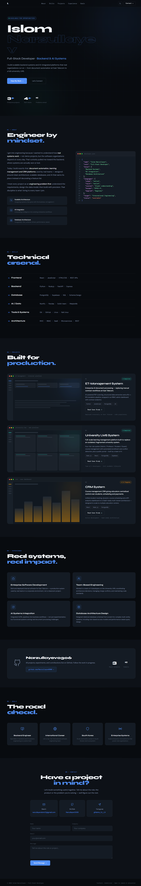

# Islom Narzullayev — Full-Stack Developer

<p align="left">
  <a href="https://portfolio-six-phi-7ekaz47rl0.vercel.app"><strong>🌐 Live Portfolio</strong></a>
  ·
  <a href="https://github.com/Narzullayev0306">GitHub</a>
  ·
  <a href="mailto:narzullevislom21@gmail.com">Email</a>
</p>

<p align="center">
  
</p>

> A production-oriented personal portfolio built to showcase full-stack development, backend engineering, and practical AI integration.

## 👋 About

I'm **Islom Narzullayev**, a Full-Stack Developer focused on building reliable web applications and backend systems.

My current stack centers around **React, FastAPI, Python, PostgreSQL, and modern web tooling**, with an interest in integrating AI capabilities into useful products.

- 💻 Full-stack web development
- ⚙️ Backend APIs and database-driven systems
- 🤖 AI integration and automation
- 📱 Responsive, accessible user interfaces
- 🚀 Deployment and production-oriented workflows
- 🌍 Open to remote opportunities and relocation

## 🚀 Highlights

- **Responsive UI** — designed for mobile, desktop, and ultrawide layouts
- **Accessible UX** — semantic HTML, keyboard-friendly interactions, ARIA states, skip navigation, and reduced-motion support
- **Theme system** — dark/light mode with system preference detection and persistence
- **Interactive projects** — browser-style previews and expandable case studies
- **Working contact flow** — React frontend → FastAPI API → PostgreSQL/Supabase
- **SEO foundations** — metadata, Open Graph/Twitter cards, favicon, and structured page content
- **Component-based React architecture** — page sections are separated into reusable components

## 🛠️ Tech Stack

| Area | Technologies |
| --- | --- |
| Frontend | React 19, Vite 8, JavaScript, CSS |
| Backend | Python, FastAPI |
| Database | PostgreSQL, Supabase, SQLAlchemy |
| Tooling | ESLint, Git, GitHub |
| Deployment | Vercel |

## 🏗️ Architecture

```text
portfolio/
├── frontend/                 # React + Vite application
│   ├── public/               # Static assets
│   └── src/
│       ├── components/       # Page sections and UI components
│       ├── data/             # Navigation, skills, project content
│       ├── styles/            # Design system and responsive CSS
│       ├── App.jsx            # Application composition and UI state
│       └── main.jsx           # Application entry point
│
├── backend/                  # FastAPI service
│   ├── main.py               # API entry point
│   └── database.py           # Database configuration/models
│
└── vercel.json               # Deployment configuration
```

## 🔄 Contact Form Flow

```text
User
  ↓
React Contact Form
  ↓
FastAPI /api/contact
  ↓
SQLAlchemy
  ↓
PostgreSQL (Supabase)
```

The frontend and backend are separated so the UI can evolve independently from the API and persistence layer.

## ♿ Accessibility & UX

Accessibility is treated as part of the implementation rather than an afterthought:

- Semantic landmarks and headings
- Skip-to-content navigation
- Keyboard-friendly mobile navigation
- ARIA state attributes where needed
- Visible focus states
- `prefers-reduced-motion` support
- Responsive layout from small mobile screens to large displays

## 📁 Project Structure

The frontend is intentionally organized by responsibility:

- `components/` — UI and page sections
- `data/` — content/configuration separated from presentation
- `styles/` — design tokens, base styles, section styles, and responsive rules
- `backend/` — API and database layer

## ⚡ Run Locally

### 1. Clone

```bash
git clone https://github.com/Narzullayev0306/portfolio.git
cd portfolio
```

### 2. Start the frontend

```bash
cd frontend
npm install
npm run dev
```

The Vite development server runs at `http://localhost:5173` by default.

### 3. Start the backend

The backend is only required for the contact form/API flow.

```bash
cd ../backend
pip install -r requirements.txt
uvicorn main:app --reload
```

Set the database connection before starting the API:

```env
DATABASE_URL=postgresql://...
```

## 🌐 Deployment

The project is configured for **Vercel** deployment. The repository uses a monorepo-style structure with the React frontend and FastAPI backend organized under separate directories.

**Live:** https://portfolio-six-phi-7ekaz47rl0.vercel.app

## 📬 Contact

**Islom Narzullayev**

- 🌐 Portfolio: https://portfolio-six-phi-7ekaz47rl0.vercel.app
- 💻 GitHub: https://github.com/Narzullayev0306
- Telegram: https://t.me/Name_N_I_N
- ✉️ Email: narzullevislom21@gmail.com
- 📍 Tashkent, Uzbekistan

---

If you're interested in collaboration, freelance work, or full-time opportunities, feel free to reach out.
